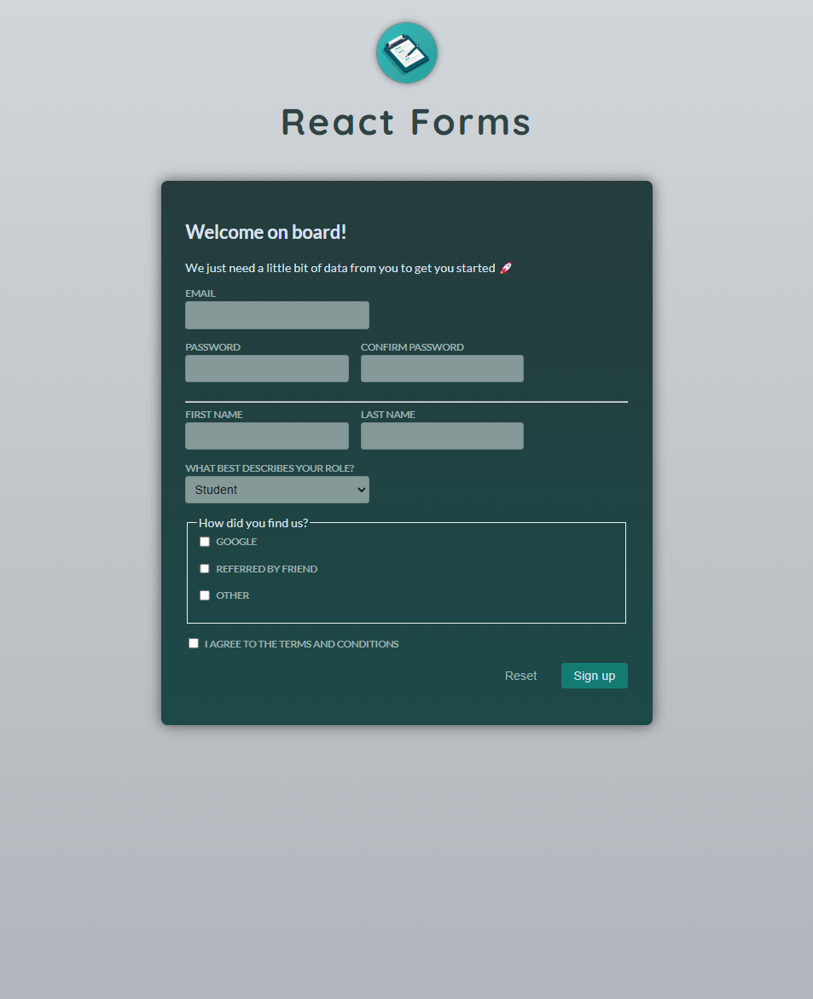

# Signup Form with Custom Hook and Validation

A React app featuring a signup form that uses a custom hook to manage form inputs, handle validation, and display error messages. The form includes fields for email, password, first name, last name, role, and acquisition channels, with real-time validation applied to the inputs. The app uses a custom hook to simplify handling form state and validation logic, allowing for efficient form handling and error management.
This project demonstrates the use of custom hooks, validation functions, and conditional rendering to manage and validate form inputs dynamically in React.
<br><br>


## 🚀 Getting Started

### **Prerequisites**
Make sure you have the following installed before running the project:
- **Node.js** (Download from [nodejs.org](https://nodejs.org/))
- **npm** or **yarn** (Comes with Node.js)
<br>

### **Installation**
1. Clone this repository:
   ```sh
   git clone https://github.com/nathenpriyonggo/react-form-actions
   ```
2. Navigate to the directory
   ```sh
   cd react-form-actions
   ```
3. Install dependencies:
   ```sh
   npm install
   ```
4. Start the development server:
   ```sh
   npm run dev
   ```
5. Open ```http://localhost:5173/``` in your browser.
<br>

## 🛠️ Built With
- **React** - A JavaScript library for building user interfaces
- **Vite** - A fast build tool for modern web projects
- **Custom Hook** - useActionState for managing form state and validation
- **Conditional Rendering** - To handle form validation error messages dynamically
- **Validation Functions** - Simple validation functions for checking email, password, and empty fields
<br>

## 🎮 App Features
- **Email and Password Validation** - Ensures the email is valid and the password is at least 6 characters long, with password confirmation validation.
- **Custom Hook for Input Management** - The app uses a custom useActionState hook to handle form input, validation, and errors.
- **Form Validation** - The form checks if the input values are valid using various validation functions like isEmail, hasMinLength, and isEqualToOtherValue.
- **Dynamic Error Handling** - Displays error messages dynamically based on the validation results.
- **Checkboxes for Acquisition Channels** - Allows users to select multiple acquisition channels (Google, friend, other).
- **Reset Button** - Resets the form fields to their initial values.
- **Submit Button** - Only submits the form if there are no validation errors.
<br>


## 🖥️ Preview
<p align="center"></p>
<br>

## 📜 License
This project is open-source. Feel free to fork, modify, and expand upon it!
<br><br>


---

✨ Happy coding! 🚀
